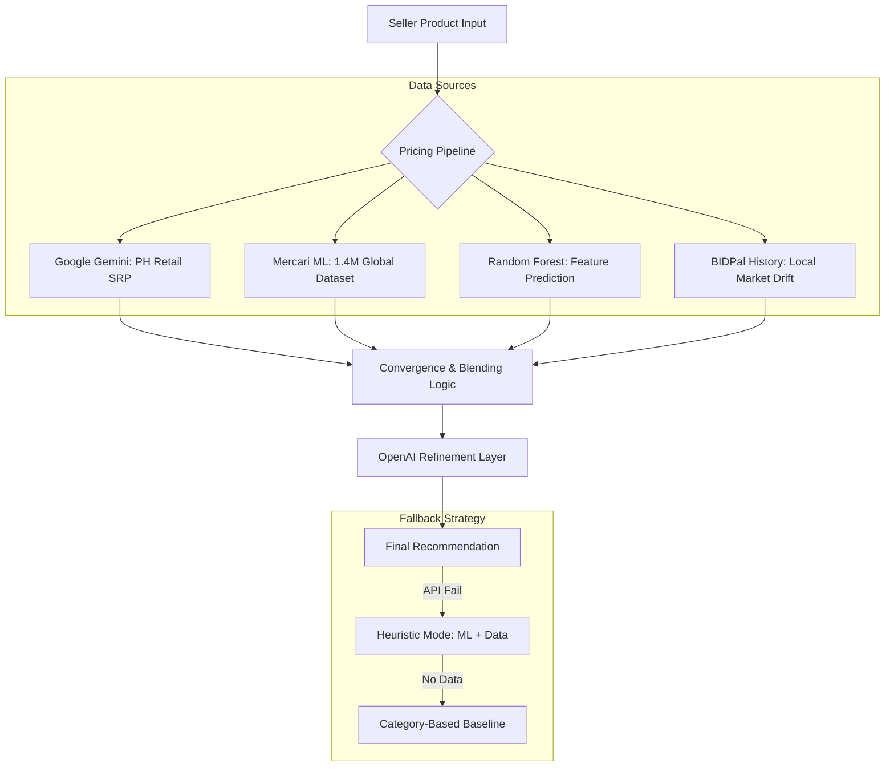

# BIDPal Methodology: Waterfall Model Documentation

## Executive Summary

**Current Methodology:** Waterfall Model
**Status:** Validated with Phase-Specific Technical Substantiation

BIDPal utilizes the **Waterfall Model** as its core development methodology. This linear and sequential approach was selected to ensure that all 27 core functional requirements were fully defined and documented before moving into the implementation phase. This model provides the high level of predictability and formal documentation required for a capstone project, ensuring that the system's architecture—specifically the real-time bidding engine and AI-driven pricing pipeline—is built on a stable, pre-validated foundation.

---

## Section 1: Methodology Assessment

### 1.1 The Waterfall Model Approach
The development of BIDPal followed a structured, linear path consisting of six distinct phases:
1.  **Requirements Analysis:** Defining all 27 functional and non-functional requirements (e.g., Real-time bidding, AI pricing).
2.  **System Design:** Designing the Supabase schema and Socket.IO architecture.
3.  **Implementation:** Sequential coding of the backend services followed by frontend components.
4.  **Testing:** Rigorous unit and integration testing of the bidding and fraud engines.
5.  **Deployment:** Staging and production launch of the BIDPal platform.
6.  **Maintenance:** Post-launch bug fixes and performance optimizations.

### 1.2 Rationale for Waterfall
| Aspect | Benefit to BIDPal |
|--------|-------------------|
| **Defined Scope** | Ideal for projects with a fixed set of requirements (27 core features) and a strict capstone deadline. |
| **Documentation-Heavy** | Ensures that each phase (Design, Implementation) is backed by formal technical specifications. |
| **Disciplined Structure** | The linear progress makes it easier to track completion percentages and ensure nothing is skipped. |
| **Quality Gatekeeping** | Each phase must be completed and validated before the next begins, preventing "technical drift." |

### 1.3 Technical Substantiation in Waterfall
In the Waterfall model, technical substantiation is not an "add-on" but a requirement of the **Design Phase**. This document serves as the formal **Technical Specification** produced during that phase, justifying the algorithmic choices (English Auction, Hybrid AI Pricing) before they were committed to code.

---

## Section 2: Technical Deep Dive - English Auction Implementation

### 2.1 English Auction Algorithm
BIDPal implements a **Closed-Bid English Auction** variant, optimized for real-time livestream engagement. The core logic is encapsulated in the `placeBid` function within `auctionsController.js`.

#### Algorithm Flow:
1.  **Validation Layer:**
    *   **Status Check:** Auction must be in `active` state.
    *   **Security Check:** User must not have active restrictions (`bidding_disabled`, `suspended`, `banned`).
    *   **Logic Check:** User cannot outbid themselves if they are already the highest bidder.
2.  **Price Enforcement:**
    *   **Bid Increment:** The bid must satisfy the formula: `amount ≥ current_price + incremental_bid_step`.
3.  **Persistence & Propagation:**
    *   **Atomic Update:** The bid is inserted into the `Bids` table. A database trigger automatically recalculates and updates the `current_price` in the `Auctions` table.
    *   **Real-time Broadcast:** Upon successful insertion, a `bid-update` event is emitted via **Socket.IO** to all connected clients, ensuring zero-latency UI updates.

#### Technical Substantiation (Code Reference):
**File:** `auctionsController.js` (L1354-1373)
```javascript
// Validate bid amount — must exceed current price by at least one step
const minBid = currentPrice + step;
const bidAmount = parseFloat(amount);

if (bidAmount < minBid) {
  return res.status(400).json({
    error: `Bid must be at least ₱${minBid.toLocaleString('en-PH')}`,
    minBid, currentPrice
  });
}

```

### 2.2 Comparative Justification
| Criterion | English Auction | Dutch Auction | Sealed-Bid |
|-----------|-----------------|---------------|------------|
| **Price Discovery** | ⭐⭐⭐⭐⭐ (Real-time) | ⭐⭐ (Descending) | ⭐⭐ (Static) |
| **Engagement** | High (Interactive) | Low (Wait-and-see) | Low (One-time) |
| **Market Fit** | Proven in PH Market | Niche/Specialized | Professional/B2B |
| **Livestream Compatibility** | Native Integration | Poor | Non-existent |

**Rationale:** The English auction model was selected because it maximizes seller revenue through competitive momentum and aligns perfectly with the "saksakan" (negotiation) culture prevalent in Filipino online selling communities.

---

## Section 3: Dynamic Pricing Implementation (ML + AI Hybrid)

### 3.1 Hybrid Pricing Engine Architecture
BIDPal employs a sophisticated **4-source pipeline** to generate accurate price recommendations for sellers. This hybrid approach ensures robustness by converging multiple data signals.



### 3.2 The 4-Source Pipeline
The core of BIDPal's valuation engine is a multi-dimensional pipeline that synthesizes data from four distinct sources to ensure price recommendations are both realistic and competitive. By converging global market data with local sales trends, the system minimizes the risk of "AI hallucination" and provides sellers with a data-driven baseline for their auctions, as detailed in the table below.

**Table 3.1: The 4-Source Pricing Pipeline**

| Source | Role | Technical Implementation |
| :--- | :--- | :--- |
| **OpenAI** | **SRP Anchor** | Fetches the current Philippine Suggested Retail Price (Brand New). |
| **Mercari Dataset (1.4M)** | **Market Signal** | Provides global secondary market value for comparable items. |
| **Random Forest Model** | **Feature Estimate** | Predicts price based on 25+ numerical features (Specs, Condition, Brand). |
| **BIDPal History** | **Local Drift** | Adjusts price based on actual successful sales within the platform. |

As illustrated in Table 3.1, the pipeline begins by establishing a "brand new" baseline using the OpenAI SRP Anchor. This source leverages real-time retail data to identify the current Philippine Suggested Retail Price, ensuring that secondhand recommendations never exceed the cost of a new unit. This is immediately balanced by the Mercari Market Signal, which cross-references a massive 1.4M item dataset. This secondary market signal is critical for establishing the "depreciated value" of goods, providing a global context for how similar items are priced in active secondhand markets.

To further refine the estimate, the system incorporates a localized Feature Estimate powered by a Random Forest Model. As shown in Table 3.1, this model transforms unstructured product data into a 25-dimensional numerical vector, allowing the system to account for specific specifications like RAM, storage, and physical condition. Finally, the BIDPal Historical Sales data is applied to account for "Local Drift." This source ensures that the final recommendation reflects actual demand within the Philippine market, adjusting the price based on successful transactions and bidding velocity recorded directly on the platform.

Technically, these four signals are converged using a weighted blending algorithm. If the primary AI estimate and the deterministic Mercari data diverge by a significant margin (greater than 2.5x), the system forces a convergence to prevent irrational pricing. This hybrid architecture ensures that every recommendation is substantiated by multiple independent data points, providing a robust and reliable pricing experience for all marketplace participants.

### 3.3 Technical Substantiation (Code Reference)
**File:** `priceRecommendationService.js` (L120-129)
```javascript
// Sanity-check: blend if formula and Mercari diverge strongly (>2.5x gap)
const mercariMedian = comparableItems.slice(0, 5)
    .reduce((s, i) => s + i.price, 0) / Math.min(5, comparableItems.length);
const ratio = basePrice / mercariMedian;

if (ratio > 2.5 || ratio < 0.4) {
    console.warn(`⚠️ Formula ₱${basePrice.toLocaleString()} vs Mercari ₱${Math.round(mercariMedian).toLocaleString()} — blending.`);
    basePrice = roundToMarketStep(basePrice * 0.80 + mercariMedian * 0.20);
}
```

### 3.4 Fallback & Graceful Degradation
To ensure 100% availability, the system implements a strict fallback hierarchy:
- **Primary:** OpenAI + ML + Historical Blend.
- **Secondary (Heuristic):** ML Model + Mercari Data only (OpenAI bypassed).
- **Tertiary (Baseline):** Predefined category-level averages (e.g., Phone = ₱8,000) adjusted by condition multipliers.

---

## Section 4: Waterfall Model Lifecycle
The development of BIDPal followed a rigorous, sequential lifecycle to ensure all technical systems were substantiated before final testing.

### 4.1 Phase 1: Requirements & Feasibility
In this phase, the 27 core requirements were finalized. Technical feasibility was established for high-risk components like the **Dynamic Pricing Engine** and **Real-time Socket.IO** bidding. This ensured that the project scope was achievable within the capstone timeline.

### 4.2 Phase 2: Technical Design & Specification
During the design phase, formal schemas and algorithmic flows were documented:
-   **Database Architecture**: Designing the Supabase relational schema.
-   **Algorithm Specification**: Defining the English Auction rules and Strike Engine escalation logic.
-   **Mockups & UI Design**: Finalizing the interface before any frontend implementation.

### 4.3 Phase 3: Implementation & Coding
The system was built in a logical sequence:
1.  **Backend Services**: Strike Engine, Pricing Service, and Auction Logic.
2.  **API Layer**: RESTful endpoints and Socket.IO event handlers.
3.  **Frontend Integration**: Building components to consume the validated API layer.

### 4.4 Phase 4: Integration & Verification
Rigorous testing was performed to verify the system against the original requirements:
-   **Functional Testing**: Ensuring the `placeBid` algorithm correctly enforces bid increments.
-   **Security Testing**: Verifying that banned users (Strike 3) cannot access bidding routes.
-   **Performance Testing**: Monitoring Socket.IO latency during high-frequency bid events.

---

## Section 5: Risk Mitigation (Anti-Fraud Ecosystem)
BIDPal implements a multi-layered security architecture designed to maintain marketplace integrity and protect sellers from malicious activities. This is managed through a centralized **Violation & Strike Engine**, which was defined during the Design Phase and verified during the Testing Phase.

### 5.1 Anti-Fraud Architecture Overview
The following subsections detail each layer of the anti-fraud ecosystem, from detection and validation through to escalation and moderation. All mechanisms were specified during the **Design Phase** and verified during the **Testing Phase** of the Waterfall lifecycle.

#### 5.2.1 Overall Anti-Fraud Process
The system follows a closed-loop detection and enforcement cycle:
1.  **Detection**: Violations are identified through automated monitors (e.g., payment timeouts), manual seller reports, or identity-matching algorithms.
2.  **Validation**: The `violationService.js` hashes the user's identity to prevent "sybil attacks" (re-registering under new emails). The system also flags **Shill Bidding** by cross-referencing payment methods and IP hashes between buyers and sellers to ensure no collusion is occurring.
3.  **Escalation**: The Strike Engine applies penalties based on the severity and frequency of the violation.
4.  **Moderation**: Admins review high-priority cases (Strike 3) for permanent banning or appeal processing. Address geolocation tagging is used to identify suspicious clusters of activity.

#### 5.2.2 Anti-Bogus Buying Mechanisms
"Bogus buying"—winning an auction with no intent to pay—is mitigated through strict temporal and behavioral enforcement:
-   **Automated Payment Windows**: Upon auction close, a `Payment_Window` is created with a strict **24-hour deadline**. Failure to complete payment triggers an automatic `payment_window_expired` violation event (`violationService.js:165`).
-   **Strike-Locked Bidding**: Users with active restrictions are blocked from placing bids. Specifically, Strike 2 triggers a `pre_authorization_required` flag, forcing the user to verify payment methods before participating in new auctions.

#### 5.2.3 Joy Reserving & Cart Hoarding Prevention
"Joy reserving" is prevented through the **Active Cart Limit** policy:
-   **Active Cart Limit (15)**: Users are restricted to 15 active items in their cart (`ACTIVE_CART_LIMIT`).
-   **Automatic Stashing & Stock Restoration**: When the limit is reached, the system automatically "stashes" the oldest item. Critically, stashed items are **released from the user's reservation**, and their quantity is restored to the global product inventory (`adjustProductAvailability`).

#### Technical Substantiation (Code Reference):
**File:** `cartController.js` (L233-248)
```javascript
// Internal helper to enforce the active cart limit
const enforceCartLimit = async (cart_id) => {
  const { data: activeItems } = await supabase
    .from('Cart_items')
    .select('cartItem_id')
    .eq('cart_id', cart_id)
    .eq('is_stashed', false)
    .order('added_at', { ascending: false });

  if (activeItems && activeItems.length > ACTIVE_CART_LIMIT) {
    const itemsToStash = activeItems.slice(ACTIVE_CART_LIMIT);
    const idsToStash = itemsToStash.map(item => item.cartItem_id);
    // ... update is_stashed: true and return stock
  }
}
```

#### 5.2.4 Mitigating Bid Shielding (Cascade Reassignment)
"Bid Shielding"—where a user places an artificially high bid to discourage others and then cancels at the last second—is neutralized via the **Cascade Reassignment Service**.
-   **Automated Winner Re-election**: If a winner fails to pay or cancels their order, the `cascadeToNextWinner` service (`cascadeService.js`) automatically identifies the second-highest bidder.
-   **Market Continuity**: Instead of voiding the auction, the system offers the item to the next legitimate bidder at their original bid price.

#### Technical Substantiation (Code Reference):
**File:** `cascadeService.js` (L120-127)
```javascript
// Update auction to reflect the new winner
await supabase
  .from('Auctions')
  .update({
    winner_user_id: nextBid.user_id,
    winning_bid_id: nextBid.bid_id,
    final_price: nextBid.bid_amount
  })
  .eq('auction_id', auctionId);
```

#### 5.2.5 The Three-Strike Escalation Model:
The BIDPal platform utilizes a progressive enforcement system designed to maintain marketplace integrity through a series of proportional penalties. This multi-layered security architecture ensures that user behavior is monitored and corrected through escalating technical restrictions, ranging from simple warnings to total account revocation. By automating the detection and enforcement cycle, the system provides a predictable and transparent moderation framework for both buyers and sellers, as summarized in the table below.

**Table 5.1: Progressive Escalation and Strike Enforcement Model**

| Level | Account Status | Technical Consequence | Primary Mechanism |
| :--- | :--- | :--- | :--- |
| **Strike 1** | **Probation/Warned** | Official Warning Issued | Persistent UI notification and moderation log entry. |
| **Strike 2** | **Restricted** | **Pre-Authorization Required** | Users must verify payment methods before placing any new bids. |
| **Strike 3** | **Suspended** | **Account Lock** | Total revocation of bidding and buying privileges; 48h review deadline. |

As detailed in Table 5.1, the system initiates enforcement upon a user's first violation, such as an initial payment window expiry or a first instance of excessive cancellation. This Strike 1 phase is characterized by an official warning issued through a persistent UI notification and a corresponding entry in the moderation log. Technically, the `applyStrike1Consequences` function generates an in-app notification while simultaneously creating a normal-priority moderation case. This allows administrators to review the context of the violation without immediately restricting the user's core bidding functionality, serving primarily as a formal notice of non-compliance.

If behavior does not improve and a second violation occurs, the account transitions to Strike 2, which imposes a behavioral restriction. The primary mechanism at this level, as indicated in Table 5.1, is the enforcement of a pre-authorization requirement for all future bidding activities. The `strikeEngine.js` service inserts a record into the `Account_Restrictions` table with a `pre_authorization_required` flag, creating a "verification wall." The bidding engine is programmatically configured to check for this restriction, blocking the user from submitting new bids until they have verified a valid payment method. This ensures a higher degree of financial commitment and filters out users who repeatedly fail to complete transactions.

The final and most severe tier of enforcement is Strike 3, which results in full account suspension and a total lock of all platform privileges. This level is triggered by a third violation, signaling chronic non-compliance or malicious intent such as "bogus buying." As specified in the enforcement model, the `applyStrike3Consequences` function applies an `account_suspended` restriction and programmatically sets a strict 48-hour review deadline. During this window, a high-priority moderation case is processed for manual audit. All bidding and buying privileges are revoked, and if the suspension is confirmed by the moderation team, the account transitions from a temporary lock to a permanent ban from the marketplace.

Technically, this escalation model is substantiated through the integration of the `strikeEngine.js` service and the `Account_Restrictions` relational schema. The system maintains data integrity by ensuring that every restriction is logged with an active status and specific metadata, such as the reason for the strike and the associated violation event ID. This allows the platform to programmatically enforce the consequences outlined in Table 5.1 in real-time across the bidding and checkout routes, ensuring that the marketplace remains secure and that penalties are applied consistently across all user accounts.

---

## Section 6: System Architecture & Data Integrity

### 6.1 Livestreaming Infrastructure (Agora RTC/RTM)
BIDPal integrates the **Agora SDK** to provide low-latency video streaming and real-time messaging. This is critical for the "Live Auction" experience.
-   **RTC (Real-Time Communication)**: Handles the video/audio feed from the seller (host) to the buyers (audience).
-   **RTM (Real-Time Messaging)**: Powers the live chat and immediate bid notifications within the stream.

### 6.2 AI-Driven Content Moderation (Gemini 2.0)
To maintain marketplace safety without manual bottlenecking, BIDPal utilizes **Gemini 2.0 Flash** for real-time image moderation.
-   **Automated Scanning**: Every product image is scanned for prohibited content (Explicit, Violence, Illegal Items).
-   **Strict Policy Enforcement**: The model is prompted as a "strict content moderation system," ensuring only valid product photos are listed.

#### Technical Substantiation (Code Reference):
**File:** `imageModerationController.js` (L27-38)
```javascript
// Gemini 2.0 Flash Prompt for Image Moderation
const prompt = `You are a strict content moderation system for a Philippine secondhand goods auction marketplace.
REJECT the image if it contains ANY of the following:
1. EXPLICIT_SEXUAL — nudity, sexual acts
2. VIOLENCE — graphic violence, gore, blood
3. ILLEGAL_ITEMS — drugs, unregistered firearms
4. HATE_SYMBOLS — extremist imagery
...
ACCEPT the image only if it clearly shows a physical product suitable for sale.`;
```

### 6.3 Inventory Synchronization & Atomicity
Data integrity is maintained through atomic operations that synchronize product status across the platform.
-   **Immediate Lockdown**: Upon order creation or auction win payment, the product status is updated to `sold` and `availability` set to `0`.
-   **Ghost Inventory Prevention**: This ensures that items cannot be multi-sold across different channels (e.g., a live auction vs. a fixed-price listing).

#### Technical Substantiation (Code Reference):
**File:** `ordersController.js` (L494-498)
```javascript
// mark ordered products as sold immediately
const { error: productStatusError } = await supabase
  .from('Products')
  .update({ status: 'sold', availability: 0 })
  .in('products_id', orderedProductIds);
```

### 6.4 Financial & Commission Engine
The platform's revenue model is programmatically enforced through the **Revenue Service**, which calculates commissions and platform earnings for every successful transaction.
-   **Dynamic Commission**: Rates are calculated based on seller tier and category, ensuring transparent platform fee collection.
-   **Transaction Records**: Every commission is logged in the `Platform_Earnings` table for auditability.

---

## Section 7: Addressing Advisor Feedback

### 7.1 Technical Substantiation Gaps
The shift to a formal Waterfall Model was specifically intended to address gaps identified by the project adviser, ensuring that documentation is a primary deliverable rather than a secondary artifact:

| Advisor Feedback | Waterfall Model Integration |
|------------------|--------------------------------|
| *"Lack substantiation for English Auction"* | Created Section 2 as part of the **Design Phase** documentation. |
| *"Lack substantiation for Dynamic Pricing"* | Created Section 3 as part of the **Design Phase** documentation. |
| *"Missing schematic diagrams"* | Developed flowcharts and state machine diagrams during the **System Design Phase**. |
| *"Expecting more technical HOW and WHY"* | Integrated design rationale tables and algorithm walkthroughs into the **Phase 2 Specifications**. |

### 7.2 Post-Implementation Verification
Following the Waterfall lifecycle, the team performs a final **Verification Pass** to ensure that the code implementation perfectly matches the design specifications. This ensures that features like "Livestream Chat Moderation" are fully substantiated before the final capstone defense.

---

## Section 8: Algorithmic Specifications

### Algorithm 1: Dynamic Price Recommendation Algorithm
This algorithm defines the hybrid 4-source pipeline used to generate price recommendations. It ensures a balance between historical accuracy, market trends, and real-time AI context.

**File:** [priceRecommendationService.js](file:///c:/Users/ds_admin/.gemini/antigravity/scratch/BIDPal/backend/services/priceRecommendationService.js#L77-L198)

| Step | Process | Logic / Code Reference |
| :--- | :--- | :--- |
| **1** | **Extraction** | Extract keywords, category, and condition from seller input (`productAnalyzer.js`). |
| **2** | **Source Synthesis** | Retrieve prices from OpenAI (SRP), Mercari (Market Data), and Random Forest (ML Estimate). |
| **3** | **Convergence** | If Formula and Market Data diverge by >2.5x, apply a weighted blend (80/20 ratio). |
| **4** | **Historical Sync** | Blend the base price with local BIDPal historical sales using a weighted decay model. |
| **5** | **AI Refinement** | Pass the final base price to Gemini/GPT-4 to determine suggested starting bids and increments. |

**Brief Explanation:**
The algorithm prevents "hallucination" by grounding the AI in deterministic market data. If the AI suggests a price that contradicts the 1.4M Mercari records, the system forces convergence towards the data-driven median, ensuring the seller receives a realistic and competitive recommendation.

---

### Algorithm 2: Random Forest Feature Encoding Process
Before the Random Forest model can predict a price, it must transform raw product text and metadata into a numerical feature vector. This process is known as **Feature Encoding**.

**File:** [mlModelService.js](file:///c:/Users/ds_admin/.gemini/antigravity/scratch/BIDPal/backend/services/mlModelService.js#L203-L243)

**The Encoding Pipeline:**
1.  **Ordinal Encoding**: Conditions (e.g., "Brand New") are mapped to a scale of 1-6.
2.  **One-Hot/Categorical Encoding**: Brand and model strings are transformed using a `stableHash` function to create unique numerical identifiers.
3.  **Binary Flagging**: The algorithm scans product descriptions for 15+ keyword clusters (e.g., "pro," "max," "broken," "sealed") to identify price premiums or defects.
4.  **Continuous Feature Scaling**: Description and name lengths are normalized to prevent outlier skewing.
5.  **Heuristic Extraction**: Screen sizes and manufacturing years are extracted via regex and converted to age-based decay factors.

**Brief Explanation:**
By converting unstructured data (like a product description) into a 25-dimensional numerical array, the Random Forest model can apply mathematical decision trees to find the most comparable historical sales. This allows the system to recognize that an "iPhone 13 Pro" with a "cracked screen" (keyword flag) should be priced significantly lower than a "sealed" (keyword flag) unit.

---
